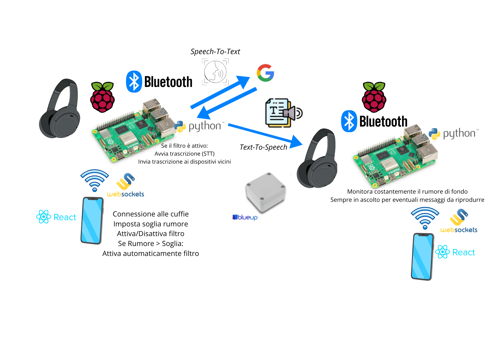

# 🎧 Presentazione del progetto

Il progetto si propone di sviluppare un **sistema intelligente per la protezione uditiva e la comunicazione in ambienti di lavoro rumorosi**, utilizzando un'infrastruttura IoT composta da **Raspberry Pi**, **cuffie Bluetooth** e **beacon BLE**.

L'obiettivo è monitorare il livello di pressione sonora dell’ambiente e attivare un filtro elettronico in caso di superamento di una soglia configurabile. Durante questa fase di insonorizzazione, se l’operatore parla, la voce viene convertita in testo tramite un sistema di **Speech-To-Text** e trasmessa agli altri operatori nelle vicinanze. La comunicazione viene poi riprodotta vocalmente tramite **Text-To-Speech**, garantendo una comunicazione efficace senza compromettere la sicurezza.

Il sistema riduce il carico cognitivo e fisico associato all'uso di chat o comandi vocali diretti, mantenendo la comunicazione fluida e discreta. A differenza delle soluzioni esistenti, questo approccio passivo permette di continuare a interagire con i colleghi senza dover rimuovere le cuffie o interrompere le operazioni.

---

# 🔧 Tecnologie e prototipazione

Il sistema sfrutta dispositivi commerciali già disponibili, come **cuffie Bluetooth a basso costo**, e l'attenuazione del rumore viene attualmente **simulata** per la validazione della logica progettuale. L’architettura software è comunque pensata per essere integrabile in un prodotto reale.

Il progetto si inserisce pienamente nell’ambito **IoT**, grazie all’uso di:
- Dispositivi connessi e wearable
- Sensori acustici e beacon BLE
- Elaborazione dei dati in tempo reale
- Tecnologie di comunicazione vocale automatica

Si ispira inoltre ai principi della **Safety Technology**, migliorando la sicurezza sul lavoro in ambienti industriali critici e rumorosi, e della **Wearable Technology**, favorendo un’interazione continua e naturale con il sistema.

---

# 🏗️ Architettura
L'architettura del sistema è raffigurata nel diagramma seguente:

---

# 📦 Repository GitHub

Il progetto è suddiviso in più componenti, ciascuno con il proprio repository:

- **STT-Broadcast** – Monitoraggio rumore e riconoscimento vocale → [GitHub Repo](https://github.com/UniSalento-IDALab-IoTCourse-2024-2025/wot-project-2024-2025-STT-Broadcast-StabileRomano.git)
- **TTS-Receiver** – Ricezione e sintesi vocale del testo in arrivo → [GitHub Repo](https://github.com/UniSalento-IDALab-IoTCourse-2024-2025/wot-project-2024-2025-TTS-Receiver-StabileRomano.git)

---

# 🔊 Descrizione

Questo repository contiene lo **script ricevitore** che gestisce la parte finale della catena di comunicazione. Le sue funzionalità principali includono:

**Localizzazione operatori**  
Scansiona continuamente i **beacon BLE** nelle vicinanze e aggiorna in tempo reale il file `beacon_status.log` con:
- Intensità del segnale (per stimare distanze)
- Identificativi unici dei dispositivi

**Gestione comunicazioni**  
Monitora costantemente i canali di comunicazione per rilevare nuovi messaggi testuali.

**Sintesi vocale**  
Avvia il processo di **Text-To-Speech** per i messaggi ricevuti.

**Integrazione sistema**  
Funziona in perfetta sincronia con il componente STT-Broadcast, garantendo una comunicazione fluida tra tutti i componenti del sistema.